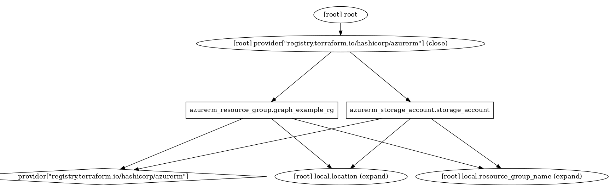

# Concurrent resource creation

This example illustrates correct plan, but eventually failing apply.
It creates resource group and storage account in parallel, without proper dependency set.
The example illustrates anti-pattern using string variable for linking resources.

