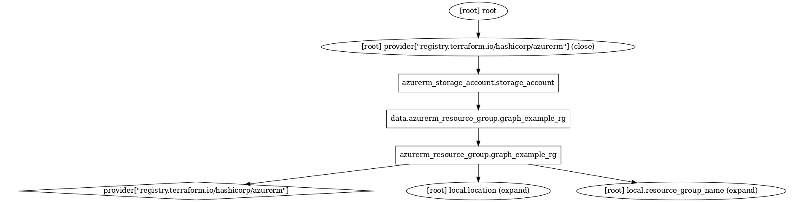

# Depends_on anti-pattern example

This example uses strong dependency between resource group -> resource group data -> storage account, so even small change in resource group causes recreation of storage account.

